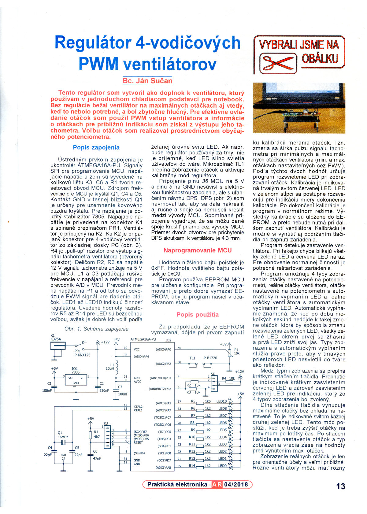
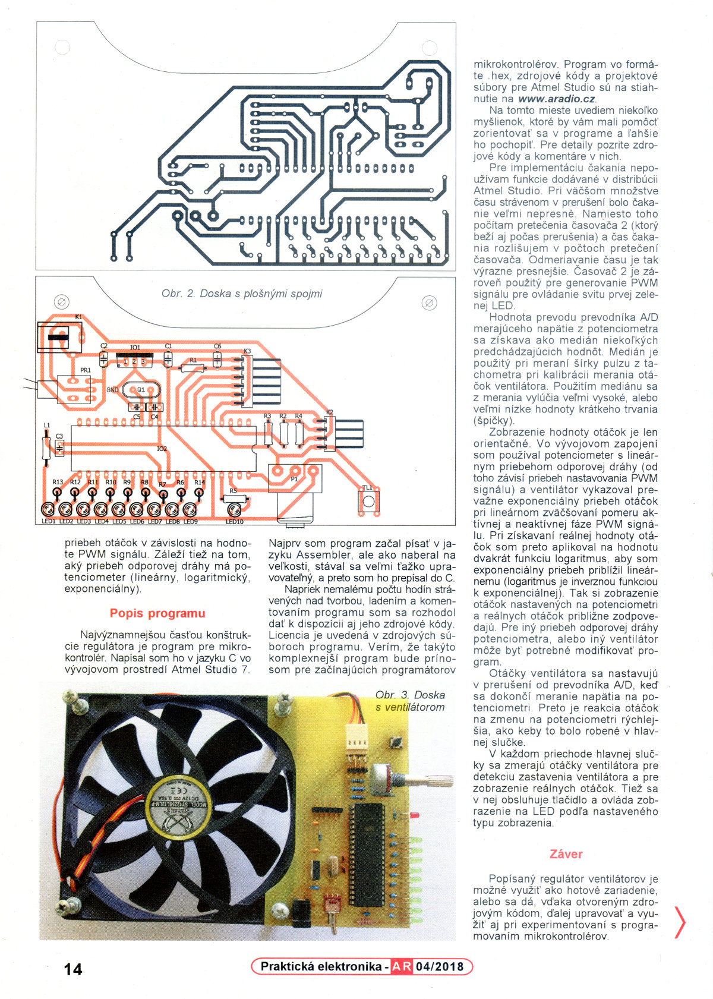
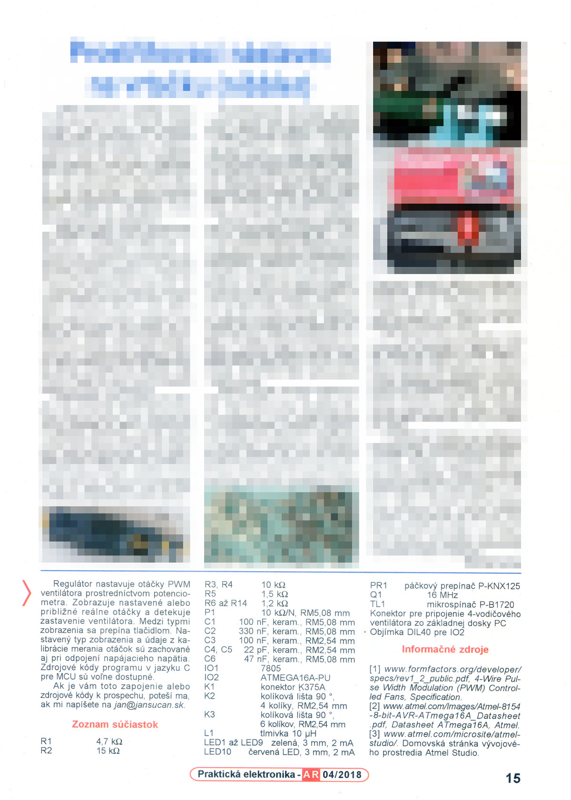

***

**This is a frozen project. It is intended to provide authentic snapshot of the
history with all the good things and all the things that could be improved.**

***

# Regulator of 4-wire PWM fans

The article was published in April 2018 in Czech magazine [Praktická
elektronika - Amatérské Radio](http://aradio.cz). It is written in Slovak
language.

The article describes construction of regulator for a 4-wire PWM fans. I have
built it because I needed to cool my laptop which was overheating under heavy
CPU load.

When switched on the first time the regulator performs calibration of RPM
indication. It measures maximal and minimal RPM and uses this range information
for indicating RPM by LED bar. This information is saved to the EEPROM of the
MCU so the calibration don't have to be performed the next time when the
regulrator is switched on. Calibration can also be forced by keeping the button
pressed when switching on the regulator.

The regulator has four modes for indicating approximate RPM of the fan. User can
cycle through these modes by pressing the button.
- Set RPM
- Real RPM
- Set RPM with auto-off of the LEDs
- Real RPM with auto-off of the LEDs

Auto-off means that when RPM does not change for a few seconds the green LEDs
are switched off and only the first green LED is on with low brightness. LEDs
are switched back on when a significant change of the RPM occures. Significant
change is change in the RPM that would lead to change of the LED's states in
non-auto-off modes.

